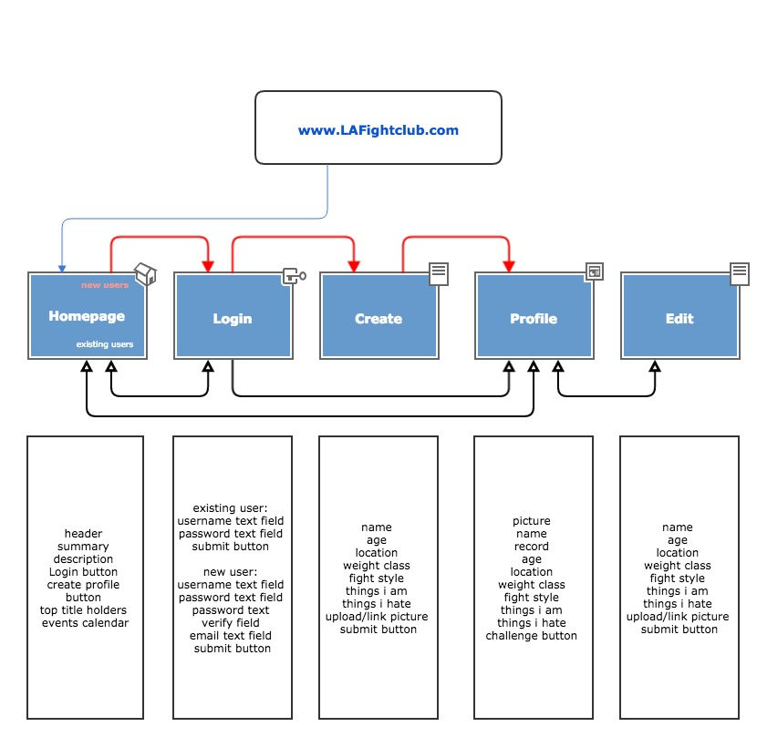
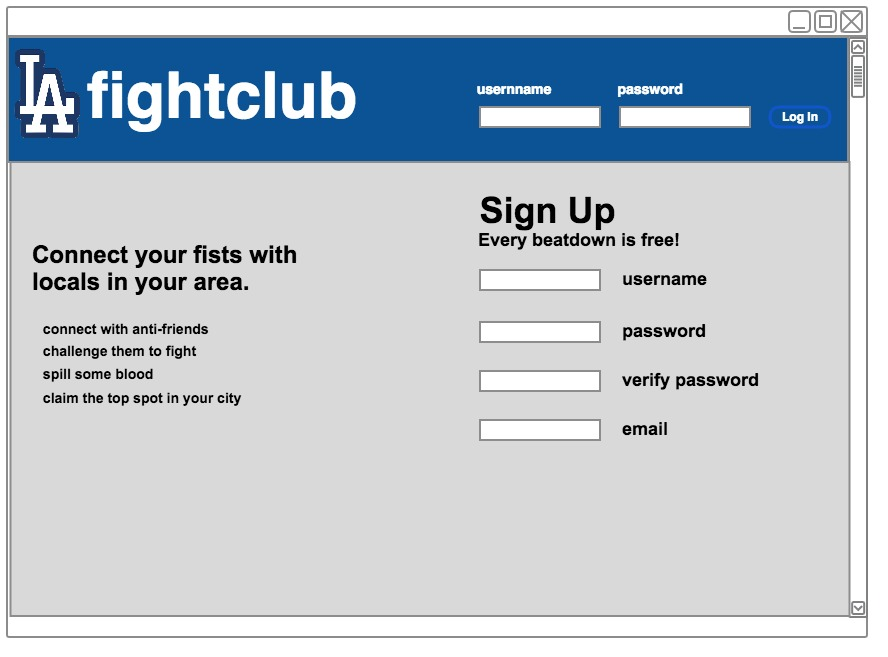
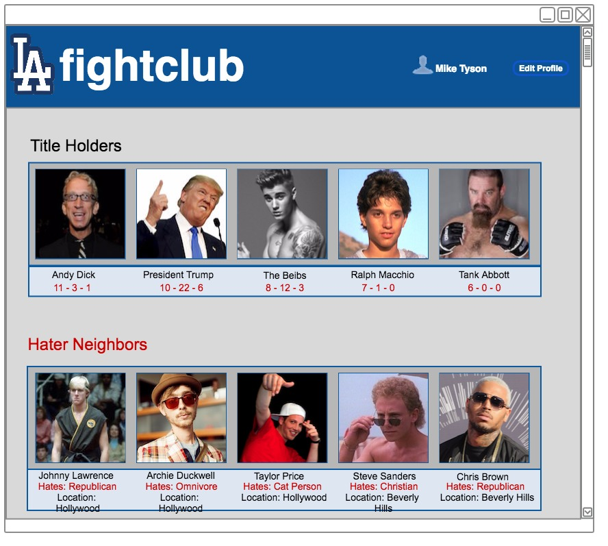
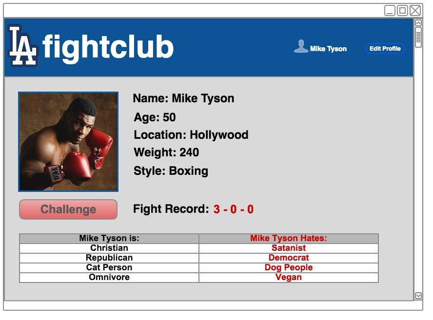
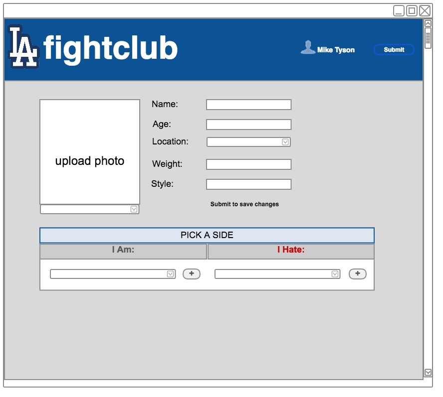

#<u>Site Description</u>

Fightclub is a take on the fake site [Rumblr](http://mashable.com/2015/11/09/tinder-for-fighting-app-rumblr/#5ZSzT3tqP8qz), in which a user makes a profile and challenges other users in their neighborhood to a fight. In Fightclub, the approach was to taylor it around a profile cut from the cloth of Facebook more so than a mobile effort like Uber or a Tinder profile. 

**_The Fightclub Experience:_**

Visit the Fightclub site, sign up for an account with your email address and create a password. Log in to your account and you are able to access the site. To customize your profile, click the large edit button on your profile page. From there you should be able to add your profile picture, personal information as well as make selections about what you like and hate so you can best be matched with those you would like to punch.

Visit the homepage of Fightclub to see a list of the newest fighters to challenge or pick from the dropdown to sort by your area to see who your latest hater-neighbors are. Click on the icon of your potential victim to see their profile and read up on their likes and hates to fuel your own anger. when you've had enough and feel like they must meet their demise, click the large "Challenge Fighter" button to send them a fight request. 

When you launch the fight request, fill out a detailed challenege message on why you want to fight (or just try and provoke them with unkind sentiments), fill out the date and time of the proposed fight. The challenged fighter will have a blue request posted on their profile. Once they get a chance to read your challenge, they have the option of accepting to turn the chellenge green, or denying to turn the challenge red.  

<u>**Tech Talk** </u>
**Fightclub was built upon:** 
Postgres version 9.6.1.0 
Rails version 4.2.6 
Amazon S3 for photo storage 
Paperclip gem for photo uploads 
bcrypt gem for authentication 
Bootstrap / Bootswatch for styling options 
Google search for bug fixes 

#<u>User Stories</u>
<li>As a user I want a safe login experience.
<li>As a user want to be able to have a custom profile
<li>As a user i want to be able to browse other user's profiles
<li>As a user I want to be able to challenge another user to a fight

#<u>Site Map</u>

#<u>Wire Frames</u>

#<u>Future Features and bugs</u>
**Known Bugs**
<li>date not working
<li>reload on edit page
<li>Heroku integration

**Future Features**
<li>impliment fight record and track fight outcomes
<li>mobile gps integration
<li>Fightclub sanctioned royal rumble events
<li>expanding to all major US cities
<li>hiring an in-house lawyer and getting insurance

